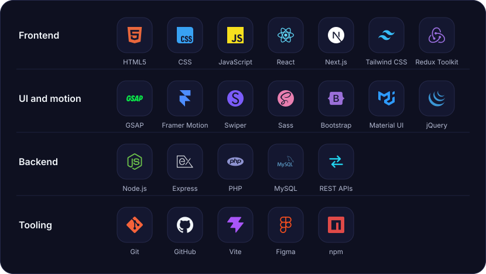
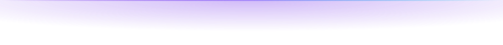

 

## About

I'm a frontend developer at Three Fourth Solutions, a creative and marketing agency in Kolkata. Two years in, I've shipped sites for a power-equipment manufacturer, a skincare brand and a multi-sector group, taking each one from design file to production with React and Next.js.

- **Corporate and brand sites** built with Next.js and Tailwind CSS, fast to load and easy to maintain
- **E-commerce** with real checkout flows: cart, payments and order emails
- **Motion and interaction** with GSAP, Framer Motion and smooth scrolling that supports the content
- **Design to code**, turning Figma files and PSDs into responsive interfaces

## Stack

## Selected work

Source code: [marsons-limited-next](https://github.com/josephpal27/marsons-limited-next), [Dermatio](https://github.com/josephpal27/Dermatio) and [altwood](https://github.com/josephpal27/altwood). More on my [repositories page](https://github.com/josephpal27?tab=repositories).

## GitHub activity

## Let's talk

I'm open to opportunities. Email is the quickest way to reach me, or find me on [LinkedIn](https://linkedin.com/in/joseph-pal).

